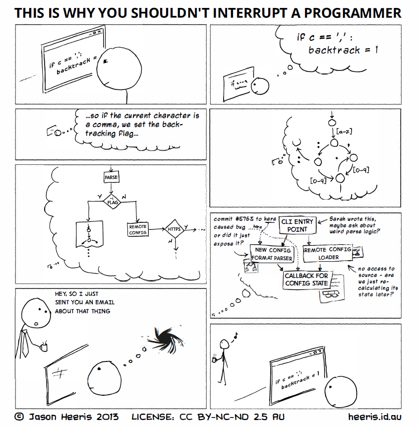
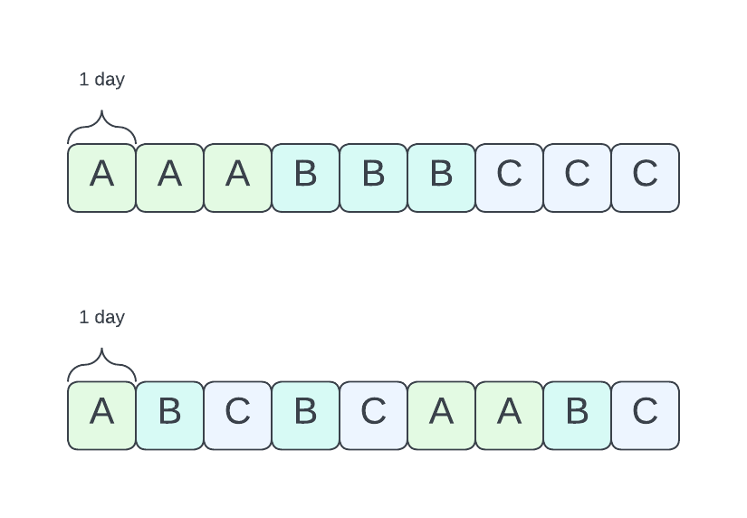
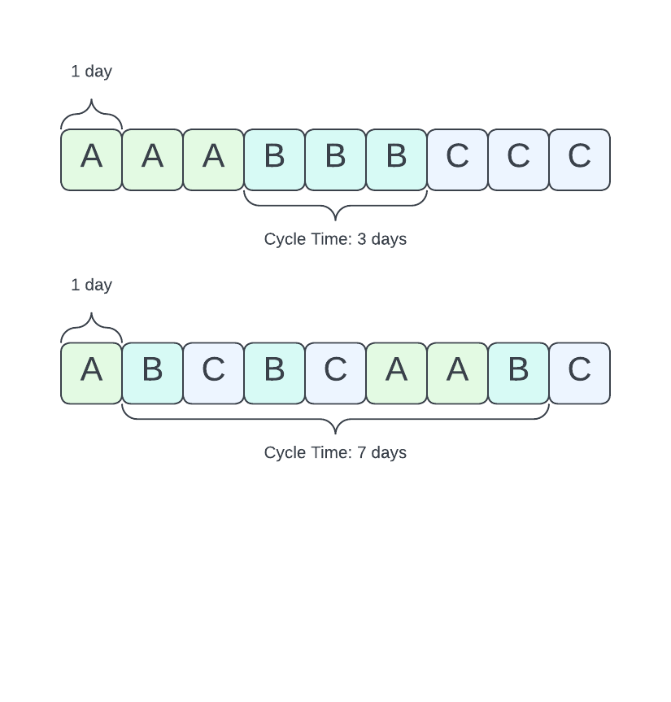
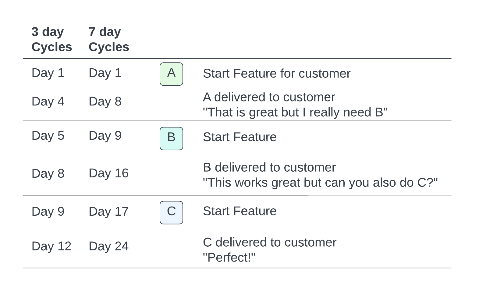
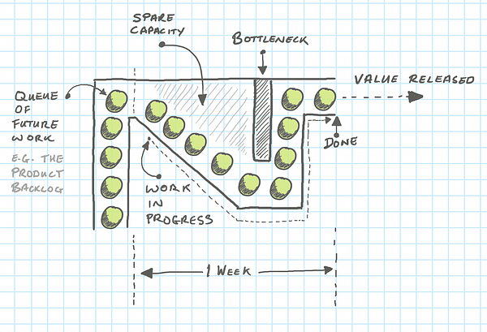
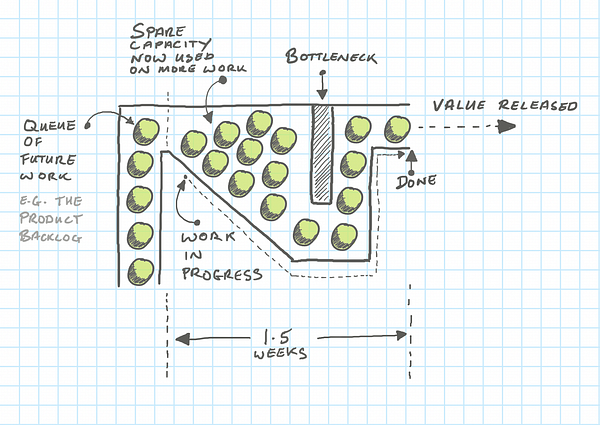

name: left
layout: true

---

name: heading
layout: true
class: center, middle, inverse

---

name: solo
layout: true
class: center, middle

---

template: heading

# Title: Work in Progress

Chris Dail

---

template: heading

<iframe width="560" height="315" src="https://www.youtube.com/embed/AbSehcT19u0" frameborder="0" allow="encrypted-media" allowfullscreen></iframe>

# What is the problem?

---

template: solo
# Too much Work in Progress (WIP)

---

template: heading
# Ideal: One Task per Developer

---

template: solo
# One Task per Developer: Limits WIP

Get more done and faster 📈

Performance Penalities with High WIP

---

template: heading

# Look at Some Evidence

Interruptions

Context Switching

Cycle Time

---

template: solo

---

template: solo

# Interruptions

Research has shown it can take 10-15 minutes to get back into the "zone" after interruption

Source: [Parnin:2010](http://www.chrisparnin.me/pdf/parnin-sqj11.pdf), [vanSolingen:1998](https://www.researchgate.net/publication/220093595_Interrupts_Just_a_Minute_Never_Is)

---

template: heading

# More WIP = More Opportunities for Interruption

---

template: solo
# Context Switching

---

template: solo
# Context Switching

Research has shown that developers who work on **2-3** projects spend on average **17%** of their effort context switching.

Source: [Tregubov,Boehm,Lane:2017](https://dl.acm.org/doi/10.1145/3084100.3084116)

---

template: heading
# More WIP = More Context Switching

---

template: solo
# Cycle Time

Metric we track and try to improve

Total calendar time taken to do a task

---

template: solo
# Effect of WIP on Cycle Time

---

---

---

template: solo
# Short Cycle Times

Deliver value earlier

Fast feedback loops (to customers, between teams)

---

---

template: heading
# More WIP = Higher Cycle Time

---

template: solo
# Mathemtical Evidence

Applying queue theory` to WIP

---

template: solo
# Little's Law

$$Cycle Time=\frac{WIP}{Throughput}$$

Throughput - How many tasks completed in a timeframe

Directly proportional

---

# Example

$$Cycle Time\,=\frac{10\,\mathrm{tasks}}{10\,\mathrm{\left.\mathrm{tasks}\middle/\mathrm{week}\right.}}=1\,\mathrm{week}$$

---

# Bottlenecks

Waiting on: PR Review, Deployment, Testing

---

# Filling spare capacity with more WIP

$$Cycle Time\,=\frac{15\,\mathrm{tasks}}{10\,\mathrm{\left.\mathrm{tasks}\middle/\mathrm{week}\right.}}=1.5\,\mathrm{weeks}$$

---

template: heading
# How Long Does it Take to Fix the Light Bulb?

Increased cycle time due to increased work in progress

---

template: solo
# How to Reduce Cycle Time?

Increase throughput

Decrease WIP

Remove bottlenecks (like PR reviews)

---

template: heading
# Personal Benefits to Limiting WIP

---

template: solo
# Personal Benefits to Limiting WIP

Improved Focus and Flow State

Decreased Cognative Load

Reduces Stress

---

template: left
# Next Time You are Blocked - Waiting for a Review

What should you do?

1. ~~Start something new?~~

2. Review Code. If your team has none, review another team's code

3. Re-review your own code

4. Review tech specs

5. Check tickets needing testing in dev/prod

6. Check recent monitors and test failures

7. Test some recent things on dev/prod related to team work

8. ...

---

template: heading
# In Progress is the Enemy of Done

Stop Starting and Start Finishing

---

BONUS
improvements to CD

